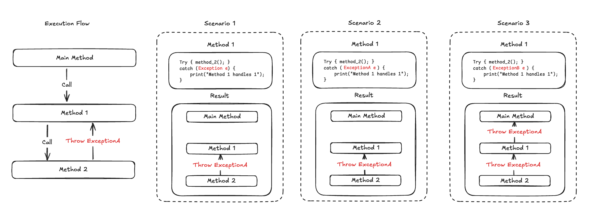

Exception
==============

**Date:** *03/17/2025*

**Author:** *Anderson Lee*

# What's an Exception
`Exception` is an event that **disrupts** (if not handled) the program when it occurs. A `exception` usually occurs due to errors that were pre-determined by the specific object or method you used such as `IllegalArgumentException`. It could be also be at a lower-level system such as `OutOfMemoryError`.

**From the program's perspective**, when an exception occurs without handling, the program exits and stops running immediately. It is much safer to **fail fast** instead of continuing with the error.

**From the developer's perspective**, exceptions allow us to hand over the responsibility of bad inputs, situations, or conditions to the user by surfacing them the exact exception occurring. For instance, let's say we build a `Calculator` class that can only handle positive integers. We can always `throws new IllegalArgumentException` when the user passes in a float or negative integers. This way, we no longer need to worry about processing the bad inputs.

**From the user's perspective**, when we see an exception with correct type thrown to us, we can get an idea of what might be wrong. For instance, we check the index value to access arrays when we see `ArrayIndexOutOfBoundsException`. 

# Common Examples of Exceptions
* `IllegalArgumentException`: When the passed in arguments don't satisfy the condition we specify.
* `FileNotFoundException`: When a file cannot be found and a file reader/writer attempts to read/write the filename provided.
* `ArrayIndexOutOfBoundsException`: When an invalid index is used to access values in an array. For example, an array of size 10 is being accessed with `index==10` or `index==-1`.
* You can find more examples in the [official document](https://docs.oracle.com/javase/8/docs/api/java/lang/Exception.html)

# Execution Flow
Exceptions are thrown in layers. When the deeper layer has an exception thrown, the upper layer must **handle** the exception. Otherwise, the exception propagates to the even upper layer until the main program stops execution. The diagram below shows the scenarios of execution flow when an exception is thrown.

1. In the first scenario, `catch (Exception e)` handles all types of exceptions. Therefore, the exception does not propagate to the upper level. 
2. In the second scenario, `catch (ExceptionA e)` catches the right  exception thrown by method 2. Therefore, the exception gets handled in method 1.
3. In the third scenario, `catch (ExceptionB e)` only handles `ExceptionB`. However, method 2 throws `ExceptionA`. Therefore, method 1 doesn't handle the right exception, resulting in propagating the exception to the main method. If the main method is a top execution, then the program will stop and show `ExceptionA is thrown`.

